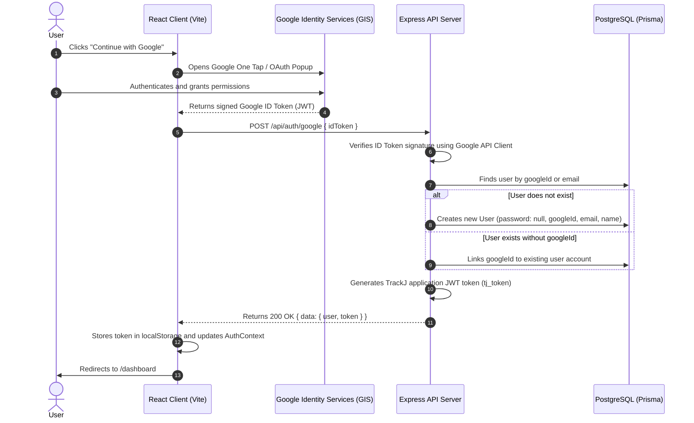

# Google OAuth 2.0 Authentication Guide for TrackJ

This document outlines the architecture, setup requirements, and step-by-step implementation strategy for integrating Google (Gmail) OAuth 2.0 authentication into TrackJ.

> **Language & Coding Standard Rule**  
> All source code, entity names, variables, type definitions, function names, comments, log messages, test suites, and documentation additions **must be written strictly in English**, adhering to the principles defined in [AGENTS.md](file:///Users/deniz/mydocuments/programming/trackJ/trackJ/AGENTS.md).

---

## 1. Overview & Architecture Strategy

TrackJ uses a decoupled architecture with a React (Vite) single-page application client and an Express TypeScript API server following Clean Architecture principles.

For Google authentication, the **Google Identity Services (GIS) ID Token Verification Flow** is selected.

### Sequence Diagram



---

## 2. Phase 1: Google Cloud Console Setup

Before implementing code, credentials must be generated in Google Cloud Console:

1. **Create/Select Project**:
   - Go to [Google Cloud Console](https://console.cloud.google.com/).
   - Create a new project named `TrackJ` or select an existing one.

2. **Configure OAuth Consent Screen**:
   - User Type: **External** (for general public SaaS).
   - App Name: `TrackJ`.
   - User support email & Developer contact email: your email.
   - Scopes to request: `.../auth/userinfo.email`, `.../auth/userinfo.profile`, `openid`.

3. **Create OAuth 2.0 Client ID**:
   - Application type: **Web application**.
   - Name: `TrackJ Web Client`.
   - **Authorized JavaScript origins**:
     - `http://localhost:5173` (Development frontend)
     - `https://yourdomain.com` (Production frontend)
   - **Authorized redirect URIs**:
     - (Leave empty if using GIS popup / One Tap, or add `http://localhost:5173` if required).
4. **Copy Credentials**:
   - Retrieve `Client ID` and `Client Secret`.
   - Store `GOOGLE_CLIENT_ID` in both server and client environments.

---

## 3. Phase 2: Database & Data Modeling (Prisma)

### Schema Adjustments

In `server/prisma/schema.prisma`:
- Users signing up through Google do not have a local password. Therefore, `password` must be optional (`String?`).
- Add `googleId` to uniquely index Google accounts.

```prisma
model User {
  id        String   @id @default(cuid())
  email     String   @unique
  name      String?
  password  String?  // Made optional for OAuth users
  googleId  String?  @unique @map("google_id")
  createdAt DateTime @default(now()) @map("created_at")
  updatedAt DateTime @updatedAt @map("updated_at")

  // Existing relations remain unchanged
  jobApplications JobApplication[]
  companies       Company[]
  tasks           Task[]
  notes           Note[]

  @@map("users")
}
```

### Migration Execution

Run the Prisma migration command to apply changes:
```bash
cd server
npx prisma migrate dev --name add_google_oauth_fields
```

---

## 4. Phase 3: Backend Implementation (Express & Clean Architecture)

### 1. Dependencies & Configuration
Install the official verification library:
```bash
cd server
npm install google-auth-library
```

Add configuration keys in `server/src/config/loadConfig.ts` and `server/.env`:
```env
GOOGLE_CLIENT_ID=your-google-client-id.apps.googleusercontent.com
```

### 2. Domain & Ports (`server/src/domain` & `application`)
Define an interface for OAuth verification in the application layer to avoid hardcoupling domain use cases to `google-auth-library`:

```typescript
// server/src/application/ports/OAuthVerifier.ts
export interface OAuthUserProfile {
  googleId: string;
  email: string;
  emailVerified: boolean;
  name?: string;
  pictureUrl?: string;
}

export interface OAuthVerifier {
  verifyGoogleToken(idToken: string): Promise<OAuthUserProfile>;
}
```

### 3. Infrastructure Adapter (`server/src/infrastructure/security/GoogleAuthService.ts`)
Implement `OAuthVerifier` using Google's SDK:
```typescript
import { OAuth2Client } from "google-auth-library";
import { OAuthVerifier, OAuthUserProfile } from "../../application/ports/OAuthVerifier.js";

export class GoogleAuthService implements OAuthVerifier {
  private client: OAuth2Client;
  private clientId: string;

  constructor(clientId: string) {
    this.clientId = clientId;
    this.client = new OAuth2Client(clientId);
  }

  async verifyGoogleToken(idToken: string): Promise<OAuthUserProfile> {
    const ticket = await this.client.verifyIdToken({
      idToken,
      audience: this.clientId,
    });
    const payload = ticket.getPayload();
    if (!payload || !payload.email) {
      throw new Error("Invalid Google token payload.");
    }

    return {
      googleId: payload.sub,
      email: payload.email.toLowerCase(),
      emailVerified: Boolean(payload.email_verified),
      name: payload.name,
      pictureUrl: payload.picture,
    };
  }
}
```

### 4. Use Case (`server/src/application/users/AuthenticateWithGoogle.ts`)
Create the application use case handling lookup, account linking, and user provisioning:
- If a user exists with `googleId`, log them in.
- If a user exists with the same `email` and verified status, link `googleId` to the existing account.
- If no user exists, create a new `User` record with `password: null` and `googleId`.
- Return user entity along with TrackJ application JWT token.

### 5. Delivery Layer (`server/src/delivery/http`)
- **Validation Schema**:
  ```typescript
  export const GoogleLoginSchema = z.object({
    body: z.object({
      idToken: z.string().min(1, "Google ID Token is required."),
    }),
  });
  ```
- **Route**:
  Add `POST /auth/google` with `authRateLimiter` in `authRouter.ts`.
- **Controller**:
  Add `googleLogin(req, res, next)` method in `AuthController.ts`.

---

## 5. Phase 4: Frontend Implementation (React + Vite)

### 1. Dependencies & Provider Setup
Install the official React wrapper:
```bash
cd client
npm install @react-oauth/google
```

Add `VITE_GOOGLE_CLIENT_ID` to `client/.env`.

Wrap the application root or auth routes in `client/src/main.tsx` or `App.tsx`:
```tsx
import { GoogleOAuthProvider } from "@react-oauth/google";

ReactDOM.createRoot(document.getElementById("root")!).render(
  <React.StrictMode>
    <GoogleOAuthProvider clientId={import.meta.env.VITE_GOOGLE_CLIENT_ID}>
      <App />
    </GoogleOAuthProvider>
  </React.StrictMode>
);
```

### 2. UI Components & Flow
Create or update the Google login button in `LoginPage.tsx` and `RegisterPage.tsx`:
- Render `<GoogleLogin />` or a custom-styled button using `useGoogleLogin`.
- On credential response:
  ```typescript
  const handleGoogleSuccess = async (credentialResponse: CredentialResponse) => {
    if (!credentialResponse.credential) return;
    try {
      await loginWithGoogle(credentialResponse.credential);
      navigate("/dashboard");
    } catch (err) {
      // Show user-friendly error notification
    }
  };
  ```
- Update `AuthContext.tsx` with a `loginWithGoogle(idToken: string)` method that sends `POST /auth/google` via `apiClient`.

---

## 6. Security & Edge Case Handling

1. **Email Verification**:
   - Reject tokens where `email_verified !== true` to avoid spoofed email hijacking.
2. **Account Linking**:
   - If an account exists with password authentication, link `googleId` safely upon successful Google verification.
3. **Password Management for Google-only Users**:
   - Profile settings must handle cases where `password` is null (e.g. prompt "Set a password" instead of "Change password").
4. **Rate Limiting**:
   - Protect `/auth/google` using the existing `authRateLimiter` middleware to prevent brute-force token verification requests.
5. **Audience Validation**:
   - Always verify that `ticket.getPayload().aud === GOOGLE_CLIENT_ID` to prevent tokens issued for other applications from being used on TrackJ.

---

## 7. Implementation Checklist

- [ ] Google Cloud Console project and OAuth credentials configured
- [ ] Environment variables updated in `server/.env` and `client/.env`
- [ ] Prisma schema updated with optional password & `googleId`
- [ ] Database migration executed
- [ ] Server port `OAuthVerifier` and adapter `GoogleAuthService` written in English
- [ ] Use case `AuthenticateWithGoogle` unit tested
- [ ] Route `POST /api/auth/google` integrated into `authRouter.ts`
- [ ] Frontend `@react-oauth/google` integrated and tested
- [ ] Error states and account linking verified
